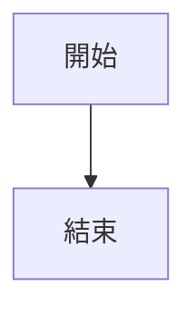

# Callout rendering test

<blockquote class="callout callout-note" markdown="1">
**基本 callout**

內含 **粗體** 與 [連結](https://example.com)
- 清單項目一
- 清單項目二

</blockquote>

可摺疊(預設展開)

展開內容

可摺疊(預設收合)

收合內容

<blockquote class="callout callout-note" markdown="1">
**外層**

外層內容

<blockquote class="callout callout-danger" markdown="1">
**內層**

巢狀內容

</blockquote>

</blockquote>

