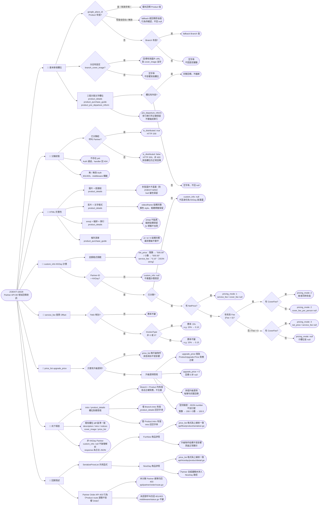

```mermaid
flowchart LR

ROOT(["ZOEKIT-18328\nPartner API-08 增加回傳資訊"]) --> S1["📌 基本新增欄位"] & S2["📌 分銷狀態"] & S3["📌 HTML 完整性"] & S4["📌 custom_info KKDay 計價"] & S5["📌 service_fee 發票 Offset"] & S6["📌 price_list upgrade_price"] & S7["📌 向下相容"] & S8["📌 回歸測試"]

  

S1 --> S1A{"google_place_id\nProduct 有值?"}

S1A -- "是（有效字串）" --> S1B(["優先回傳 Product 值"])

S1A -- "有值但空白 / 無效" --> S1B3(["fallback 或回傳原始值\n行為待確認，不回 null"])

S1A -- 否 --> S1A2{"Branch 有值?"}

S1A2 -- 是 --> S1C(["fallback Branch 值"])

S1A2 -- 否 --> S1D(["空字串\n不因語言變動"])

S1 --> S1E{"分店有設定\nbranch_cover_image?"}

S1E -- 是 --> S1F(["回傳有效圖片 URL\n與 cover_image 並存"])

S1E -- 否 --> S1F2(["空字串\n不影響其他欄位"])

S1 --> S1G["三個方案文字欄位\nproduct_details\nproduct_purchase_guide\nproduct_pre_departure_inform"]

S1G --> S1H{"欄位有內容?"}

S1H -- 是 --> S1I(["完整回傳，不截斷"])

S1H -- 否 --> S1J(["空字串，不回 null"])

S1G --> S1K(["pre_departure_inform\n多行換行符正確保留\n不壓縮成單行"])

  

S2 --> S2A{"已分銷給\n呼叫 Partner?"}

S2A -- 是 --> S2B(["is_distributed: true\nHTTP 200"])

S2A -- 否 --> S2C(["is_distributed: false\nHTTP 200，非 403\n其他欄位仍正常回傳"])

S2 --> S2D(["不存在 pid\nAuth 通過，handler 回 404"])

S2 --> S2E(["無 / 無效 Auth\n401/403，middleware 攔截"])

  

S3 --> S3A["圖片 + 超連結\nproduct_details"]

S3A --> S3B(["多張圖片不遺漏（防 ZOEKIT-9255）\nhref 屬性保留"])

S3 --> S3C["影片 + 文字樣式\nproduct_details"]

S3C --> S3D(["video/iframe 結構完整\n顏色 style、粗體標籤保留"])

S3 --> S3E["emoji + 縮排 + 換行\nproduct_details"]

S3E --> S3F(["emoji 不亂碼\n縮排結構保留\nbr 標籤不去除"])

S3 --> S3G["條列清單\nproduct_purchase_guide"]

S3G --> S3H(["ul / ol / li 結構完整\n巢狀層級不壓平"])

  

S4 --> S4A{"Partner-ID\n= KKDay?"}

S4 --> S4LA["金額格式規範"]

S4LA --> S4L(["net_price：整數 → &quot;500.00&quot; / 小數 → &quot;500.50&quot;\nservice_fee：&quot;0.10&quot;（JSON string）"])

S4A -- 否 --> S4B(["custom_info: null\n不暴露計價資訊"])

S4A -- 是 --> S4C{"已分銷?"}

S4C -- 否 --> S4D(["custom_info: null\n不因身份為 KKDay 就暴露"])

S4C -- 是 --> S4E{"有 NetPrice?"}

S4E -- 是 --> S4F(["pricing_mode: 1\nservice_fee / cover_fee null"])

S4E -- 否 --> S4E2{"有有效 Fee\n(Fee > 0)?"}

S4E2 -- 是 --> S4E3{"有 CoverFee?"}

S4E3 -- 是 --> S4H(["pricing_mode: 2\n兩者同時有值"])

S4E3 -- 否 --> S4G(["pricing_mode: 2\ncover_fee_per_person null"])

S4E2 -- "否 / Fee = 0" --> S4E4{"有 CoverFee?"}

S4E4 -- 是 --> S4I(["pricing_mode: 3\nnet_price / service_fee null"])

S4E4 -- 否 --> S4J(["pricing_mode: null\n子欄位皆 null"])

  

S5 --> S5A{"TWD 幣別?"}

S5A -- 否 --> S5D(["費率不變"])

S5A -- 是 --> S5B{"InvoiceType\n非 0 或 3?"}

S5B -- 是 --> S5C(["費率 -5%\ne.g. 15% → 0.10"])

S5B -- 否 --> S5E(["費率不變\ne.g. 15% → 0.15"])

  

S6 --> S6A{"方案有升級選項?"}

S6A -- 否 --> S6C(["price_list 無升級物件\n其他項目不受影響"])

S6A -- 是 --> S6B["升級選項情境"]

S6B --> S6B1(["upgrade_price 值與 ProductUpgrade.Price 對應正確"])

S6B --> S6B2(["upgrade_price = 0\n回傳 0 非 null"])

S6B --> S6B3(["多個升級選項\n每筆均完整回傳"])

S6B --> S6B4(["型別驗證：JSON number 不加引號\n整數 → 200 / 小數 → 150.5"])

  

S7 --> S7A["intro / product_details\n欄位對應情境"]

S7A --> S7A1(["Branch + Product 均有值\n各自正確對應，不互蓋"])

S7A --> S7A2(["僅 Branch.Intro 有值\nproduct_details 回空字串"])

S7A --> S7A3(["僅 Product.Intro 有值\nintro 回空字串"])

S7 --> S7B(["既有欄位 diff 基準一致\ndescription / intro / notices\ncover_image / price_list"])

S7 --> S7C(["非 KKDay Partner\ncustom_info: null 不破壞解析\nresponse 為合法 JSON"])

  

S8 --> S8A["SerializePriceList 共用函式"]

S8A --> S8B["FunNow 商品詳情"]

S8B --> S8B1(["price_list 格式與上線前一致\napi/flow/product/serializer.go"])

S8B --> S8B2(["升級物件結構不受影響\n頁面正常顯示"])

S8A --> S8C["NiceDay 商品詳情"]

S8C --> S8C1(["price_list 格式與上線前一致\napi/niceday/product/detail.go"])

S8C --> S8C2(["Partner 自組邏輯未滲入\nNiceDay 路徑"])

S8 --> S8D["Partner Order API 403 行為\n（Product route 調整不影響 Order）"]

S8D --> S8E(["未分銷 Partner 建單仍回 403\napi/partner/order/route.go"])

S8D --> S8F(["未認證呼叫仍回 401/403\nmiddleware/status.go 不變"])

  

click ROOT "https://zoeknow.atlassian.net/browse/ZOEKIT-18328"
```

